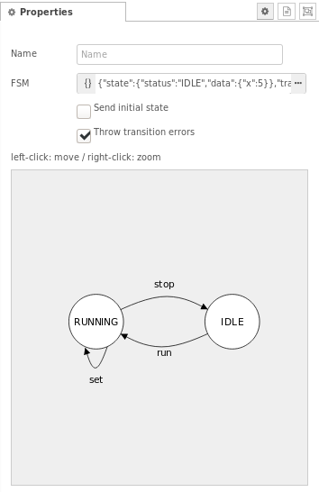

# Node Red State Machine
A finite state machine (FSM) implementation for node red. Displays also a graphical representation of the state machine.  


## Installation

### In Node-RED
* Via Manage Palette -> Search for "node-red-contrib-finite-statemachine"

### In a shell
* go to the Node-RED installation folder, in OS X it's usually: `~/.node-red`
* run `npm install node-red-contrib-finite-statemachine`

## Usage

You can find detailed usage information in the [Usage Manual](https://github.com/lutzer/node-red-contrib-finite-statemachine/blob/master/MANUAL.md).

### Node Configuration


#### Basic FSM structure
The statemachine of `finite state machine` is defined by a JSON object within the line *FSM* (Finite State Machine):

- *state* holds the initial state. It shall contain a *status* field.
- *transitions* holds the possible states as keys (shown as upper case strings). As values it contains one or more key/value pairs, consisting of the transition string (lower case strings) and the resulting state.
- additional *data* fields are optional. (See [Usage Manual](https://github.com/lutzer/node-red-contrib-finite-statemachine/blob/master/MANUAL.md))

```json
{
  "state": {
    "status": "IDLE"
  },
  "transitions": {
    "IDLE": {
      "run": "RUNNING"
    },
    "RUNNING": {
      "stop": "IDLE",
      "set": "RUNNING"
    }
  }
}
``` 

### Input
The input topics of the  `finite state machine`  are defined by the transition table setup in the node configuration.

- sending a `msg` to the node containing a `msg.topic` set to a defined transition string triggers a state change.
- `msg.topic`= *reset* is a reserved transition to reset the machine to its initial state (*"state"*), therefore *reset* shall not be used as a transition name in the transition table.
- `msg.topic`= *sync* is used to set the state manualy. its payload needs to be a json object, containing a *status* field. sync should not be used in the transition table

### Output

The output of `finite state machine` sends a  `msg` whenever there is a valid transition.
Remark: This also may be a valid transition without any state change.

The output contains:
- *status*: Outputs the state of the FSM.
- *data*: Outputs the *data* object of the FSM. Read more about the data object in the [Usage Manual](https://github.com/lutzer/node-red-contrib-finite-statemachine/blob/master/MANUAL.md).


### Further information
Check Node-REDs info panel to see more information on how to configure the state machine.


## Example

For more examples, read the [Usage Manual](https://github.com/lutzer/node-red-contrib-finite-statemachine/blob/master/MANUAL.md).

### Minimal state machine

This example shows a state machine with two states. There is only one `msg.topic` ("toggleState") which toggles between the two states IDLE and RUNNING.


```json
{
  "state": {
    "status": "IDLE"
  },
  "transitions": {
    "IDLE": {
      "toggleState": "RUNNING"
    },
    "RUNNING": {
      "toggleState": "IDLE"
    }
  }
}
``` 


```json
[{"id":"70d24837.fa7bb8","type":"finite-state-machine","z":"9b6215d1.9ceba8","name":"","fsmDefinition":"{\"state\":{\"status\":\"IDLE\"},\"transitions\":{\"IDLE\":{\"toggleState\":\"RUNNING\"},\"RUNNING\":{\"toggleState\":\"IDLE\"}}}","sendInitialState":false,"showTransitionErrors":true,"x":480,"y":240,"wires":[["236d8d.5ef6da74"]]},{"id":"236d8d.5ef6da74","type":"debug","z":"9b6215d1.9ceba8","name":"","active":true,"tosidebar":false,"console":false,"tostatus":true,"complete":"payload","targetType":"msg","x":720,"y":240,"wires":[]},{"id":"701f2b41.e4ecb4","type":"inject","z":"9b6215d1.9ceba8","name":"","topic":"toggleState","payload":"","payloadType":"str","repeat":"","crontab":"","once":false,"onceDelay":0.1,"x":250,"y":240,"wires":[["70d24837.fa7bb8"]]},{"id":"a75e8c2f.0b2378","type":"comment","z":"9b6215d1.9ceba8","name":"sending topic \"toggleState\" toggles between the two states","info":"","x":420,"y":180,"wires":[]}]
```  

## Development

* run `npm install`
* install grunt `npm install -g grunt-cli`
* build with `npm run build`
* create link in node-red folder by running `npm install <local dir>` within the node-red install directory
