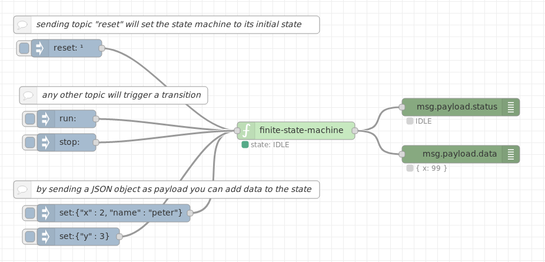
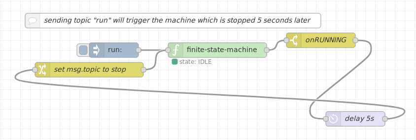
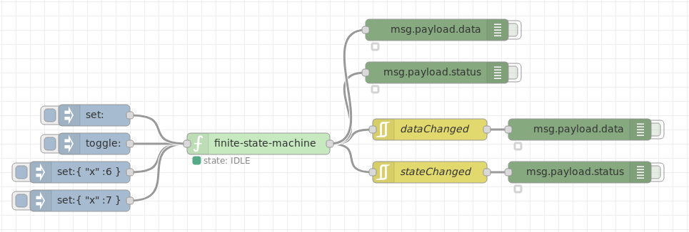

# Node Red State Machine
A finite state machine (FSM) implementation for node red. Displays also a graphical representation of the state machine.  
  
**Fig. 1:** Node appearance

### Table of contents
1. [Installation](#installation)  
	1.1 [In Node-RED](#installation_in_node-red)  
	1.2 [In a shell](#installation_in_a_shell)  
2. [Usage](#usage)  
    2.1 [Node configuration](#node_conifguration)  
    2.2 [Input](#input)  
    2.3 [Output](#output)  
    2.4 [Handling of the data object](#handling_of_the_data_object)  
    2.5 [Further information](#further_information)  
3. [Example flows](#example_flows)  
	3.1 [Minimal state machine](#minimal_state_machine)  
	3.2 [Simple state machine with data object](#simple_state_machine_with_data_object)  
	3.3 [State machine with feedback](#state_machine_with_feedback)  
	3.4 [Changing the data object](#changing_the_data_object)  
4. [Development](#development)  
5. [Hints for upgrading from earlier versions](#hints_for_upgrading)  


<a name="installation"></a>
## Installation

<a name="installation_in_node-red"></a>
### In Node-RED

* Via Manage Palette -> Search for "node-red-contrib-finite-statemachine"

<a name="installation_in_a_shell"></a>
### In a shell

* go to the Node-RED installation folder, in OS X it's usually: `~/.node-red`
* run `npm install node-red-contrib-finite-statemachine`


<a name="usage"></a>
## Usage

<a name="node_conifguration"></a>
### Node Configuration
  
**Fig. 2:** Node properties


<a name="basic_fsm_structure"></a>
#### Basic FSM structure
The statemachine of `finite state machine` is defined by a JSON object within the line *FSM* (Finite State Machine):

- *state* holds the initial state. It shall contain a *status* field.
- *transitions* holds the possible states as keys (shown as upper case strings). As values it contains one or more key/value pairs, consisting of the transition string (lower case strings) and the resulting state.
- additional *data* fields are optional.

```json
{
  "state": {
    "status": "IDLE"
  },
  "transitions": {
    "IDLE": {
      "run": "RUNNING"
    },
    "RUNNING": {
      "stop": "IDLE",
      "set": "RUNNING"
    }
  }
}
```  
**Fig. 3:** Basic FSM structure definition (only with transitions)


<a name="optional_data_object"></a>
#### Optional *data* object
The optional *data* object may be used in the (initial) "state" definition as well as in every transition definition. Whenever a valid transition occurs the *data* portion of its transition definition is handled.
In addition, transitions with and without *data* definitions may be mixed arbitrarily.

Fig. 4 shows *data* definition portions within the *state* object and in transitions.

```json
"state": {
  "status": "IDLE",
  "data": {
    "x": 99
  }
}
```

```json
"transitions": {
  "RUNNING": {
    "stop": {
      "status": "IDLE",
      "data": {
        "x": 0
      }
    },
    "set": "RUNNING"
  }
}
```  
**Fig. 4:** *data* object portions


<a name="input"></a>
### Input

The input topics of the  `finite state machine`  are defined by the transition table setup in the [node configuration](#node_conifguration).

- sending a `msg` to the node containing a `msg.topic` set to a defined transition string triggers a state change.
- `msg.topic`= *reset* is a reserved transition to reset the machine to its initial state (*"state"*), therefore *reset* shall not be used as a transition name in the transition table.


<a name="output"></a>
### Output

The output of `finite state machine` sends a  `msg` whenever there is a valid transition.
Remark: This also may be a valid transition without any state change.

The output contains:
- *status*: Outputs the state of the FSM.
- *data*: Outputs the *data* object of the FSM.


<a name="handling_of_the_data_object"></a>
### Handling of the *"data"* object
- The *data* object within the "state" definition initializes the *data* object at the first start of the flow.
- The contents of the *data* object within the "transitions" definition sets the *data* object at the according transition.
- The contents of the *data* object may also be changed or extended by sending a `msg` with a valid transition (within `msg.topic`) containing a JSON object as payload with a *data* definition.

**Note:** Sending a `msg` without a valid transition cannot change the *data* object (see example below).


<a name="further_information"></a>
### Further information
Check Node-REDs info panel to see more information on how to use the state machine.


<a name="example_flows"></a>
## Example flows

<a name="minimal_state_machine"></a>
### Minimal state machine

This example shows a state machine with two states without any *data*-object.

There is only one `msg.topic` ("toggleState") which toggles between the two states IDLE and RUNNING.


```json
{
  "state": {
    "status": "IDLE"
  },
  "transitions": {
    "IDLE": {
      "toggleState": "RUNNING"
    },
    "RUNNING": {
      "toggleState": "IDLE"
    }
  }
}
```  
**Fig. 5:** Minimal state machine JSON object


  
**Fig. 6:** Minimal state machine


```json
[{"id":"70d24837.fa7bb8","type":"finite-state-machine","z":"9b6215d1.9ceba8","name":"","fsmDefinition":"{\"state\":{\"status\":\"IDLE\"},\"transitions\":{\"IDLE\":{\"toggleState\":\"RUNNING\"},\"RUNNING\":{\"toggleState\":\"IDLE\"}}}","sendInitialState":false,"showTransitionErrors":true,"x":480,"y":240,"wires":[["236d8d.5ef6da74"]]},{"id":"236d8d.5ef6da74","type":"debug","z":"9b6215d1.9ceba8","name":"","active":true,"tosidebar":false,"console":false,"tostatus":true,"complete":"payload","targetType":"msg","x":720,"y":240,"wires":[]},{"id":"701f2b41.e4ecb4","type":"inject","z":"9b6215d1.9ceba8","name":"","topic":"toggleState","payload":"","payloadType":"str","repeat":"","crontab":"","once":false,"onceDelay":0.1,"x":250,"y":240,"wires":[["70d24837.fa7bb8"]]},{"id":"a75e8c2f.0b2378","type":"comment","z":"9b6215d1.9ceba8","name":"sending topic \"toggleState\" toggles between the two states","info":"","x":420,"y":180,"wires":[]}]
```  
**Fig. 7:** Minimal state machine flow


<a name="simple_state_machine_with_data_object"></a>
### Simple state machine with data object

Set finite state machine definiton to:

```json
{
  "state": {
    "status": "IDLE",
    "data": {
      "x": 99
    }
  },
  "transitions": {
    "IDLE": {
      "run": {
        "status": "RUNNING",
        "data": {
          "x": 42
        }
      }
    },
    "RUNNING": {
      "stop": {
        "status": "IDLE",
        "data": {
          "x": 0
        }
      },
      "set": "RUNNING"
    }
  }
}
```  
**Fig. 8:** Simple state machine JSON object

#### State description
This example gives a state machine with two states (IDLE, RUNNING) and three transitions. Two of them (*run*, *stop*) change between the two states, the third (*set*) is used only to externally change the *data* object contents in the state RUNNING via an input `msg` with an appropriate `msg.topic` = "set".


  
**Fig. 9:** Simple state machine


```json
[{"id":"70d12b2e.625c9c","type":"tab","label":"Simple state machine with data object","disabled":false,"info":""},{"id":"a0edf135.e14588","type":"finite-state-machine","z":"70d12b2e.625c9c","name":"","fsmDefinition":"{\"state\":{\"status\":\"IDLE\",\"data\":{\"x\":99}},\"transitions\":{\"IDLE\":{\"run\":{\"status\":\"RUNNING\",\"data\":{\"x\":42}}},\"RUNNING\":{\"stop\":{\"status\":\"IDLE\",\"data\":{\"x\":0}},\"set\":\"RUNNING\"}}}","sendInitialState":false,"showTransitionErrors":true,"x":600,"y":260,"wires":[["cb19a198.11647","b1877454.ee2168"]]},{"id":"9befd239.ea94b","type":"inject","z":"70d12b2e.625c9c","name":"","topic":"reset","payload":"","payloadType":"str","repeat":"","crontab":"","once":true,"onceDelay":0.1,"x":210,"y":120,"wires":[["a0edf135.e14588"]]},{"id":"456671ae.4a071","type":"comment","z":"70d12b2e.625c9c","name":"sending topic \"reset\" will set the state machine to its initial state","info":"","x":380,"y":80,"wires":[]},{"id":"bcc44c08.7c6d08","type":"inject","z":"70d12b2e.625c9c","name":"","topic":"run","payload":"","payloadType":"str","repeat":"","crontab":"","once":false,"onceDelay":0.1,"x":210,"y":240,"wires":[["a0edf135.e14588"]]},{"id":"201e40f8.865b2","type":"inject","z":"70d12b2e.625c9c","name":"","topic":"set","payload":"{\"x\" : 2, \"name\" : \"peter\"}","payloadType":"json","repeat":"","crontab":"","once":false,"onceDelay":0.1,"x":290,"y":400,"wires":[["a0edf135.e14588"]]},{"id":"61fd9c83.dd95fc","type":"inject","z":"70d12b2e.625c9c","name":"","topic":"set","payload":"{\"y\" : 3}","payloadType":"json","repeat":"","crontab":"","once":false,"onceDelay":0.1,"x":230,"y":440,"wires":[["a0edf135.e14588"]]},{"id":"c6add2b4.c41ee","type":"comment","z":"70d12b2e.625c9c","name":"any other topic will trigger a transition","info":"","x":290,"y":200,"wires":[]},{"id":"a4c93b9f.44d3f","type":"inject","z":"70d12b2e.625c9c","name":"","topic":"stop","payload":"","payloadType":"str","repeat":"","crontab":"","once":false,"onceDelay":0.1,"x":210,"y":280,"wires":[["a0edf135.e14588"]]},{"id":"3b5f9a43.cdf68e","type":"comment","z":"70d12b2e.625c9c","name":"by sending a JSON object as payload you can add data to the state","info":"","x":380,"y":360,"wires":[]},{"id":"cb19a198.11647","type":"debug","z":"70d12b2e.625c9c","name":"","active":true,"tosidebar":false,"console":false,"tostatus":true,"complete":"payload.status","targetType":"msg","x":880,"y":220,"wires":[]},{"id":"b1877454.ee2168","type":"debug","z":"70d12b2e.625c9c","name":"","active":true,"tosidebar":false,"console":false,"tostatus":true,"complete":"payload.data","targetType":"msg","x":880,"y":300,"wires":[]}]
```  
**Fig. 10:** Simple state machine flow


<a name="state_machine_with_feedback"></a>
### State machine with feedback

Set finite state machine definiton to:

```json
{
  "state": {
    "status": "IDLE"
  },
  "transitions": {
    "IDLE": {
      "run": "RUNNING"
    },
    "RUNNING": {
      "stop": "IDLE"
    }
  }
}
```  
**Fig. 11:** State machine with feedback JSON object

This example gives a self-stopping behaviour after a defined amount of time: Transition *run* triggers the state machine to *state* RUNNING, the feedback loop activates the transition *stop* after a delay of 5 seconds so that the state machine changes back to *state* IDLE.

  
Fig. 12: State machine with feedback


```json
[{"id":"854a9f95.2f9f7","type":"tab","label":"State machine with feedback flow","disabled":false,"info":""},{"id":"47aa9b50.b6825c","type":"finite-state-machine","z":"854a9f95.2f9f7","name":"","fsmDefinition":"{\"state\":{\"status\":\"IDLE\",\"data\":{\"x\":5}},\"transitions\":{\"IDLE\":{\"run\":\"RUNNING\"},\"RUNNING\":{\"stop\":\"IDLE\",\"set\":\"RUNNING\"}}}","sendInitialState":false,"showTransitionErrors":true,"x":480,"y":160,"wires":[["a8262434.cf7498"]]},{"id":"87fbee09.255fe8","type":"inject","z":"854a9f95.2f9f7","name":"","topic":"run","payload":"","payloadType":"str","repeat":"","crontab":"","once":false,"onceDelay":0.1,"x":270,"y":160,"wires":[["47aa9b50.b6825c"]]},{"id":"a8262434.cf7498","type":"switch","z":"854a9f95.2f9f7","name":"onRUNNING","property":"payload.status","propertyType":"msg","rules":[{"t":"eq","v":"RUNNING","vt":"str"}],"checkall":"true","repair":false,"outputs":1,"x":690,"y":140,"wires":[["1bb1822b.773f76"]]},{"id":"1bb1822b.773f76","type":"delay","z":"854a9f95.2f9f7","name":"delay 5s","pauseType":"delay","timeout":"5","timeoutUnits":"seconds","rate":"1","nbRateUnits":"1","rateUnits":"second","randomFirst":"1","randomLast":"5","randomUnits":"seconds","drop":false,"x":760,"y":300,"wires":[["983f9b74.7bcbd8"]]},{"id":"983f9b74.7bcbd8","type":"change","z":"854a9f95.2f9f7","name":"set msg.topic to stop","rules":[{"t":"set","p":"topic","pt":"msg","to":"stop","tot":"str"}],"action":"","property":"","from":"","to":"","reg":false,"x":220,"y":200,"wires":[["47aa9b50.b6825c"]]},{"id":"a0a931fb.60bc4","type":"comment","z":"854a9f95.2f9f7","name":"sending topic \"run\" will trigger the machine which is stopped 5 seconds later","info":"","x":390,"y":100,"wires":[]}]
```  
**Fig. 13:** State machine with feedback flow


<a name="changing_the_data_object"></a>
### Changing the "data" object

During a valid transition the *data* object can be changed or extended via the nodes input (externally) or changed via the node transition definition (internally).

Sending a `msg` containing no valid transition within the `msg.topic` cannot lead to any *data* object changes.

Therefore see example "Simple state machine with data object" above: To be able to change the *data* object externally in the *state* RUNNING, the transition *set* is defined: This (valid) transition does not change the *state* but may change the *data* object within *state* RUNNING like the two lower injections do.
In the example the definition of the upper set injection is like follows:

  
**Fig. 14:** Properties of a `msg`with a JSON *data* object

As can seen this changes the present "data" object element "x" to a numerical value of '2' and adds an additional "data" object element "name" with the string "peter".


<a name="development"></a>
## Development

* run `npm install`
* install grunt `npm install -g grunt-cli`
* build with `npm run build`


<a name="hints_for_upgrading"></a>
## Hints for upgrading from node versions 0.2.11 and earlier to version 1.x.x
The `finite state machine` node of earlier versions contained three different outputs. In the actual node there is only one output present. Typically only this one output is needed.
If one needs to have the other two output functions there is the possibility of "emulating" them via the node `rbe` (*Report by Exception* node). This node is able to filter the output in a manner that the old additional two outputs are present.

  
**Fig. 15:** Flow with `rbe` node generating compatible outputs

As an example the `rbe`node *stateChanged* may be configured like shown in Fig. 16.

  
**Fig. 16:** Configuration of the `rbe` node


```json
[{"id":"cd27ad32.fb2ce8","type":"tab","label":"State machine with rbe","disabled":false,"info":""},{"id":"741f9b7e.bd3d34","type":"finite-state-machine","z":"cd27ad32.fb2ce8","name":"","fsmDefinition":"{\"state\":{\"status\":\"IDLE\",\"data\":{\"x\":5}},\"transitions\":{\"IDLE\":{\"toggle\":\"RUNNING\",\"set\":\"IDLE\"},\"RUNNING\":{\"toggle\":\"IDLE\"}}}","sendInitialState":false,"showTransitionErrors":true,"x":480,"y":300,"wires":[["2c5a6aeb.c6e35e","22380426.fd5b5c","fd0fdc38.21c4c8","19579af6.c76055"]]},{"id":"6f9447ed.5d58","type":"inject","z":"cd27ad32.fb2ce8","name":"","topic":"set","payload":"{ \"x\" :6 }","payloadType":"json","repeat":"","crontab":"","once":false,"onceDelay":0.1,"x":230,"y":340,"wires":[["741f9b7e.bd3d34"]]},{"id":"3e18afe6.ce355","type":"inject","z":"cd27ad32.fb2ce8","name":"","topic":"set","payload":"{ \"x\" :7 }","payloadType":"json","repeat":"","crontab":"","once":false,"onceDelay":0.1,"x":230,"y":380,"wires":[["741f9b7e.bd3d34"]]},{"id":"d8ffa74c.efa948","type":"inject","z":"cd27ad32.fb2ce8","name":"","topic":"toggle","payload":"","payloadType":"str","repeat":"","crontab":"","once":false,"onceDelay":0.1,"x":250,"y":300,"wires":[["741f9b7e.bd3d34"]]},{"id":"8ee732f2.01075","type":"debug","z":"cd27ad32.fb2ce8","name":"","active":false,"tosidebar":true,"console":false,"tostatus":true,"complete":"payload.data","targetType":"msg","x":930,"y":280,"wires":[]},{"id":"2c5a6aeb.c6e35e","type":"rbe","z":"cd27ad32.fb2ce8","name":"dataChanged","func":"rbei","gap":"","start":"","inout":"out","property":"payload.data","x":720,"y":280,"wires":[["8ee732f2.01075"]]},{"id":"22380426.fd5b5c","type":"rbe","z":"cd27ad32.fb2ce8","name":"stateChanged","func":"rbei","gap":"","start":"","inout":"out","property":"payload.status","x":720,"y":340,"wires":[["6abdae73.1aaac"]]},{"id":"6abdae73.1aaac","type":"debug","z":"cd27ad32.fb2ce8","name":"","active":false,"tosidebar":true,"console":false,"tostatus":true,"complete":"payload.status","targetType":"msg","x":930,"y":340,"wires":[]},{"id":"2d6a156e.5f98ca","type":"inject","z":"cd27ad32.fb2ce8","name":"","topic":"set","payload":"","payloadType":"str","repeat":"","crontab":"","once":false,"onceDelay":0.1,"x":250,"y":260,"wires":[["741f9b7e.bd3d34"]]},{"id":"fd0fdc38.21c4c8","type":"debug","z":"cd27ad32.fb2ce8","name":"","active":false,"tosidebar":true,"console":false,"tostatus":true,"complete":"payload.status","targetType":"msg","x":730,"y":200,"wires":[]},{"id":"19579af6.c76055","type":"debug","z":"cd27ad32.fb2ce8","name":"","active":false,"tosidebar":true,"console":false,"tostatus":true,"complete":"payload.data","targetType":"msg","x":730,"y":140,"wires":[]}]
```  
**Fig. 17:** Compatible outputs flow
